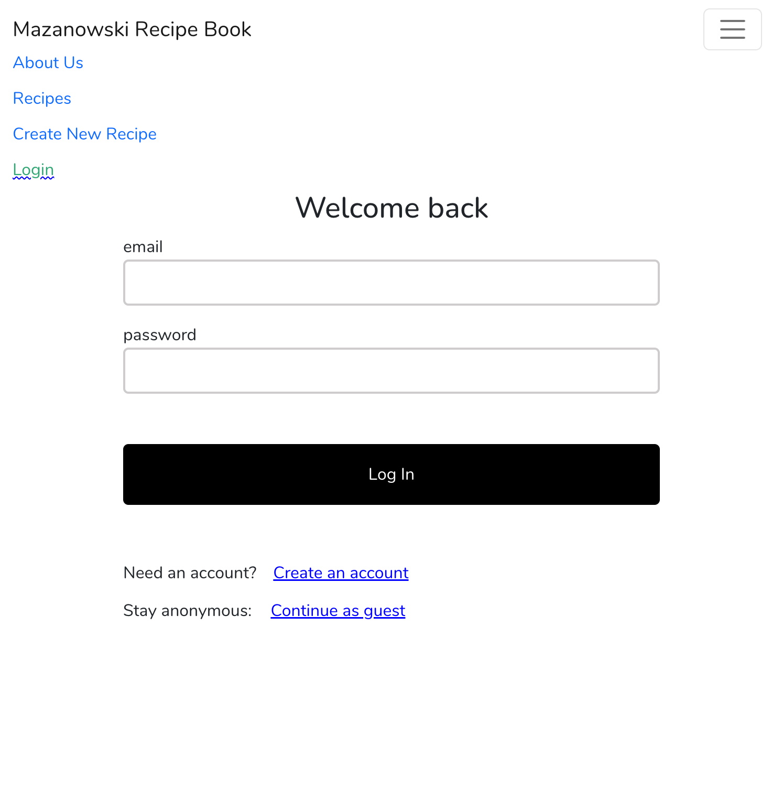
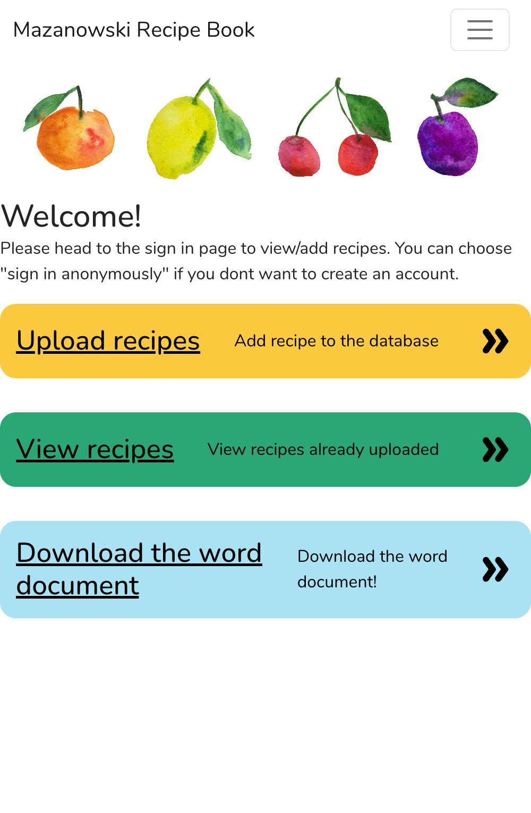
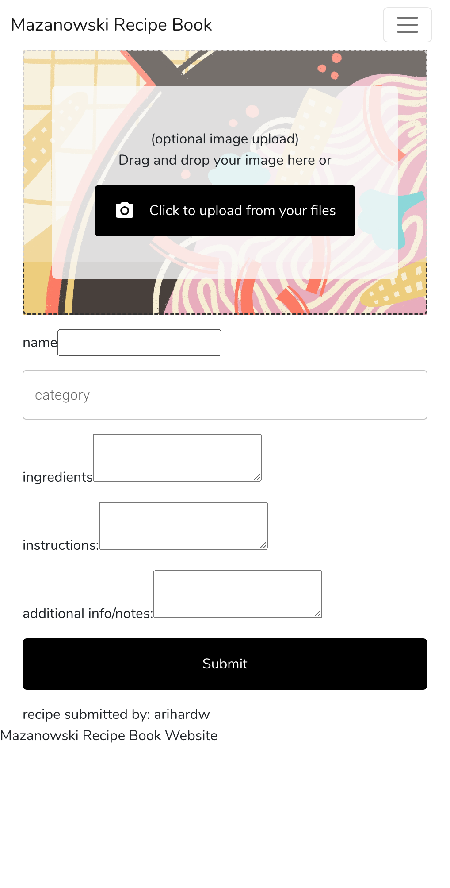
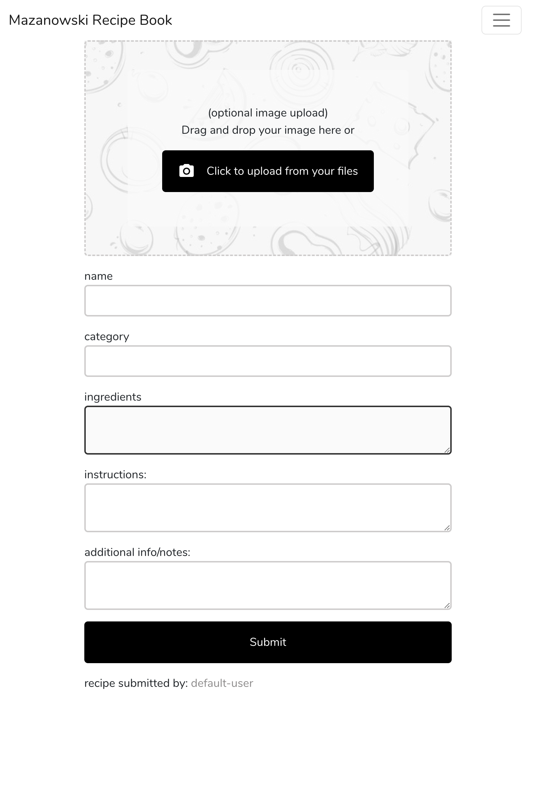
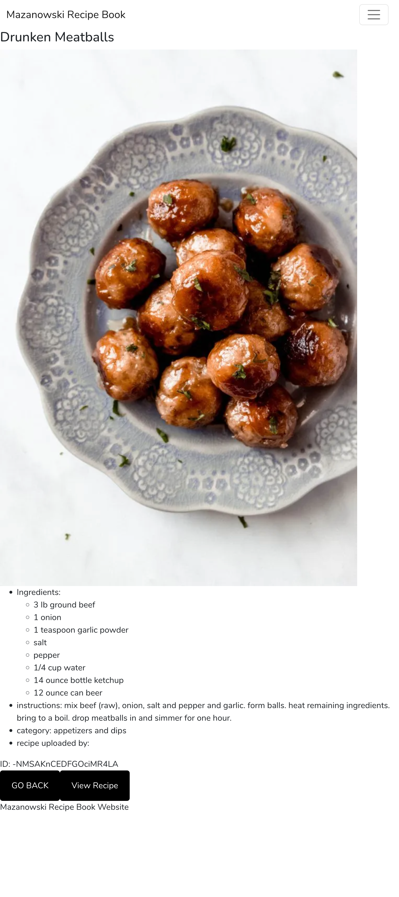
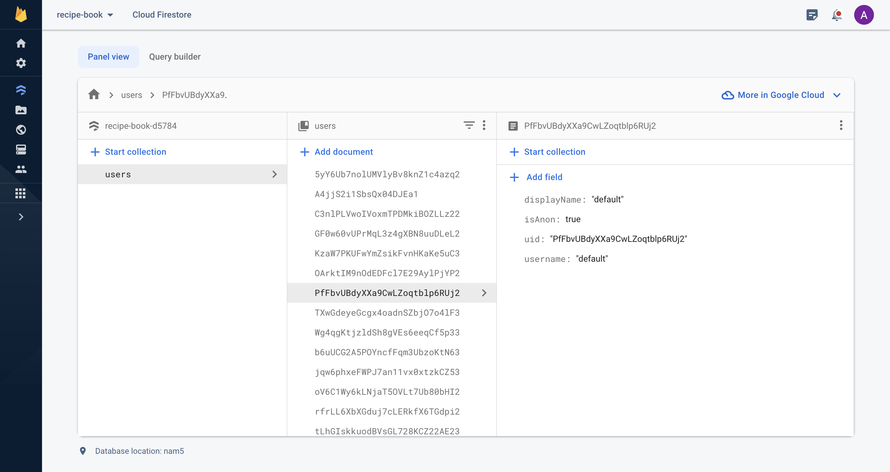
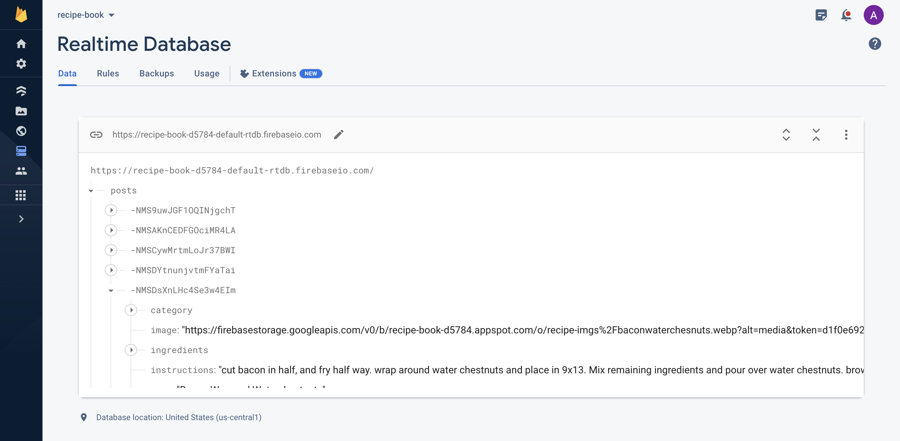
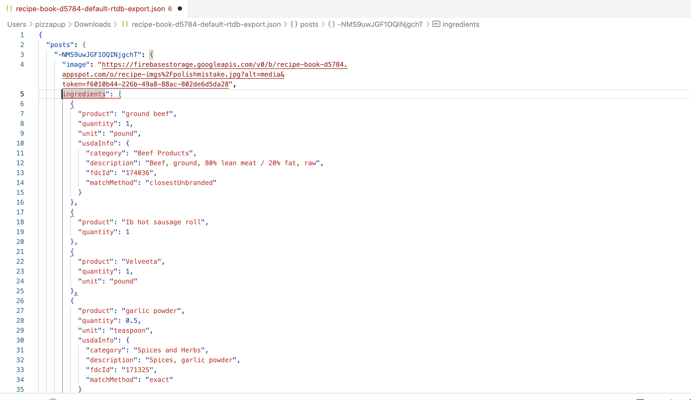
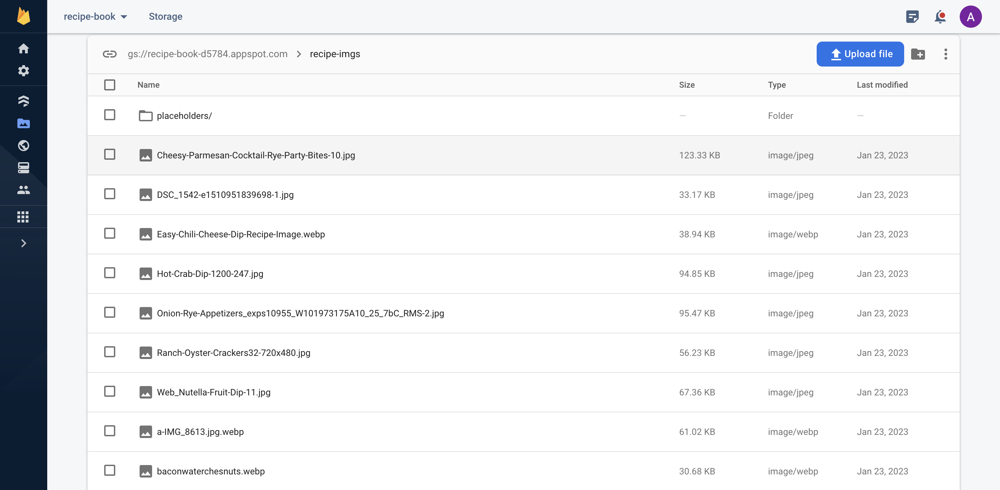

# :taco: Mazanowski Recipe Book :sandwich: 

## Contents (Index)
- [About](#about): Cookbook history, meaning, project links)
- [Features/Tools Overview](#featurestools-overview): Brief explanation of tools and features the app uses
- [Current Website Pages](#current-website-pages): Images (screenshots) and some info on the pages in the site
    - [Login](#login)
    - [Home](#home)
    - [About](#about)
    - [Recipe Gallery](#recipe-gallery)
    - [Recipe Details](#recipe-details)
    - [Recipe Form](#recipe-form)
- [Google Firebase](#google-firebase-firebasegooglecom): Information on Firebase and its use in the application
     - [Cloud Firestore](#cloud-firestore)
     - [Realtime Database](#realtime-database)
     - [Cloud Storage](#cloud-storage)
- [Coming Soon](#coming-soon): Hopes and goals for the future of the application

> Visit Site: 
[mazanowski-recipe-book.netlify](https://mazanowski-recipe-book.netlify.app/)

## About 

The Mazanowski Recipe Book website is based on the 1999 family recipe book compiled by Natalie Mazanowski.

Since the original copy was created, the family has grown and many family members have learned about their intolerance and allergies. My hope it that this application will help not only share these recipes to those without the physical copies, but to help those of us with dietary restrictions to enjoy the recipes.

<!-- This application is a one-dude[^1] undertaking and both the front-end and back-end has been implemented by yours truly. (So please be understanding if things are not perfect!) -->

This application is a one-person undertaking and both the front-end and back-end has been implemented by yours truly. (So please be understanding if things are not perfect!)

> Visit Site: 
[mazanowski-recipe-book.netlify](https://mazanowski-recipe-book.netlify.app/)

> GitHub: 
[mazanowski-recipe-book](https://github.com/pizzapup/recipe-book-maz)

## Features/Tools Overview 

- Firebase | learn how Google Firebase is used in this application in the [Firebase section of this README.md](https://github.com/pizzapup/mazanowski-recipe-book/edit/master/README.md#google-firebase-firebasegooglecom)
- React.js - Open-source front-end JavaScript library | [React.dev](https://react.dev/)
- React Router - Enables client-side routing | [reactrouter.com](https://reactrouter.com/en/main)
- Netlify - Remote-first cloud computing development platform that includes build, deploy, and serverless backend services | [Netlify.com](https://www.netlify.com/?utm_source=google&utm_medium=paid_search&utm_campaign=12755510784&adgroup=118788138897&utm_term=netlify&utm_content=kwd-309804753741&creative=514583565825&device=c&matchtype=b&location=9016137&gclid=CjwKCAiA2rOeBhAsEiwA2Pl7Q8qWxXEjMYPKyIWJ0_BFL9zm7CN4bEvsdr2UJXl7wLAYoPv1o7mtHBoCC3EQAvD_BwE)
- Zestful API - Transforms ingredients from opaque strings to meaningful data in easy-to-consume JSON format | [zestfuldata.com](https://zestfuldata.com/)
- Apple Vision OCR - Detect and recognize multilanguage text in images | [developer.apple.com](https://developer.apple.com/documentation/vision/recognizing_text_in_images)
- MUI Autocomplete - Normal text input enhanced by a panel of suggested options | [mui.com/material-ui/react-autocomplete](https://mui.com/material-ui/react-autocomplete/)
- MUI Material Design Icons - React Material Icons from the official website | [mui.com/material-ui/material-icons](https://mui.com/material-ui/material-icons/)

##  Current Website Pages
Preview live application at [mazanowski-recipe-book.netlify.app](https://mazanowski-recipe-book.netlify.app/)
Navigation client-side routing using [react-router](https://reactrouter.com/en/main)

  
<h3>Login</h3>

  
  

  
<h3>Home</h3>

  
  

  
<h3>About</h3>

  
  

  
<h3>Recipe Gallery</h3>

  
  Recipe Gallery Page (current deployment)             |  Recipe Gallery Page (previous deployment)
:-------------------------:|:-------------------------:
 |  

  

  
Mobile View

  
  

  

  
<h3>Recipe Form</h3>

  
Submit new recipes to the database using the apps recipe form. Data submitted is uploaded to firebase in realtime and can be accessed by the app (for example, the recipe is immediately displayed in the recipe gallery)

Recipe Form Screenshot (previous deployment)             |  Recipe Form Screenshot (current deployment)
:-------------------------:|:-------------------------:
  |  

  
<h3>Recipe Details</h3>

## Google Firebase [firebase.google.com](https://firebase.google.com/)

Firebase is a Backend-as-a-Service (Baas) part of Googles could development toolkit. It offers NoSQL and real-time hosting of databases, content, social authentication, notifications, and services, such as a real-time communication server.
Below are screenshots of the various Firebase services implemented in the Mazanowski Recipe Book app and brief descriptions of how they are being used.

  

    <h3>Cloud Firestore</h3> | <a href="https://firebase.google.com/docs/firestore?authuser=0&hl=en">Cloud Firestore Docs</a>
  

  
 The app uses Cloud Firestore to hold basic user information to provide easy communication with Firebase Authentication and authentication-dependent features of the application. If anonymous users decide to sign up, their sign-in credentials are linked to the anonymous account so they can continue working with their protected data in future sessions. Firebase provides more information on anonymous accounts in their [authentication docs](https://firebase.google.com/docs/auth/web/anonymous-auth)

Basic information stored in Firestore Database:
- User ID (UID | string)
- Username (username | string)
- User's display name (displayName | string)
- Is the account anonymous? (isAnon | boolean) 

  

    <h3>Realtime Database</h3> | <a href="https://firebase.google.com/docs/database?authuser=0&hl=en">Realtime Database Docs</a>
  

  
Firebase Realtime Database is a cloud-hosted NoSQL database that stores and syncs data. Data is stored as JSON, synchronized in realtime to every connected client, and remains available when the app goes offline. The app uses Realtime database to store recipe data. 
##### Zestful API | [zestfuldata.com](https://zestfuldata.com/)
- When submitting recipes through the app, the ingredient data is parsed using the Zestful API before being stored in the database. The API returns detailed information on each ingredient (USDA info, measurement units, categorization, etc) which maintains data integrity and provides a great foundation for future features.
###### Snippet of recipe data exported JSON

Realtime Database          |  JSON (Exported Recipe Data)
:-------------------------:|:-------------------------:
 |   |

  

    <h3>Cloud Storage</h3> | <a href="https://firebase.google.com/docs/storage?hl=en&authuser=0">Cloud Storage Docs</a>
  

  
The Firebase SDKs for Cloud Storage add Google security to file uploads and downloads, regardless of network quality, and can be used to store images, audio, video, or other user-generated content. The application uses Cloud Storage to store application images. When submitting a new recipe, the uploaded image is sent to Cloud Storage and the Cloud Storage URL for the image is stored with the recipe data in the Realtime Database.

## Coming Soon

### Database
After all base recipes have been entered, we will have a better idea of what we are working with. This will allow room for more features such as:
- Ingredient substitutions
- Create shopping list
- Measurement unit conversions
- Filtering
- Searching

### UI/UX Design
- Refresh and update styles
The front-end is far from finished, but does what it needs to do (allow for data entry, display the data, modify the data, and use authentication). Working without a wireframe, mockup, or any design reference has made it challenging to implement quick styles.

<!-- [^1]: "one-(wo)man", "one-man", and/or "one-person" just didn't feel right. i consider "dude" universal -->
